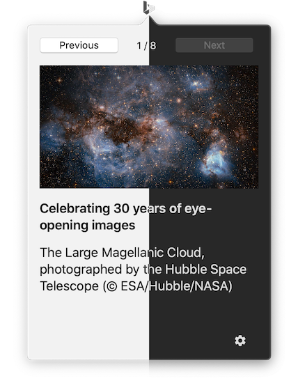

# biji

Unofficial Bing wallpaper app for macOS built in SwiftUI

## Features

* Menu bar app built in SwiftUI
* Automatically check and fetch latest wallpapers from Bing
* View original Bing page
* Switch among supported locales
* Image cache management
* Dark mode
* Dependency management by Swift Package Manager

## Screenshot

## Todo

- [x] Get an icon
- [x] I18n
- [x] Cache management
- [x] Preferences window
- [ ] Launch on login

## License

GNU GPL v3. See [LICENSE](LICENSE) for details.

Bing and Bing symbol are registered trademarks of Microsoft. This application is not associated with Microsoft and Bing.

Redistribution on App Store is prohibited.
